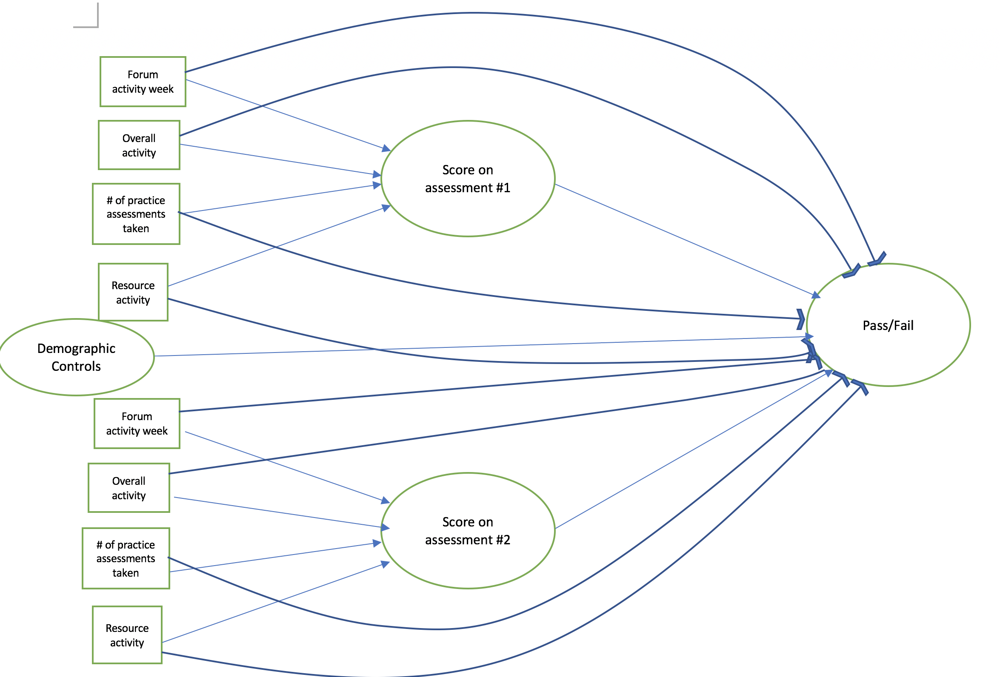

##Introduction

In part 1 of this project, I showed that with nearly 90% accuracy, students at risk for failing could be detected as early as the first quarter of a course. Early identification of these students is important to best provide intervention to reduce risk of failure, but what are the best types of intervention?

To answer this question, I shift from the random forest machine learning techniques to logistic regressions and structural equation modeling(SEM). The strengths of random forest lie in its predictive power, particularly when the relationship between the predictor variables and the target variable tends to be non-linear in nature. However, a drawback is it's weakness in interpretating the underlying relationship between predictors and the target. Conversely, the strengths of logistic regressions and SEM are both their ability to interpret the magnitude of effects as well as the effects of variables controlling for confounding effects


```{r load packages and data, echo = TRUE, message=FALSE, results ='hide'}
#load packages
library(readr)
library(lavaan)
library(dplyr)
library(caret)
library(MASS)
rm(list = ls())
setwd('/Users/williamkye/Box Sync/nyc data science academy/mooc/')
sem <- read_csv("sem1.csv")

```

```{r cleaning , echo=FALSE,message=FALSE, results ='hide'}
sem = sem %>% mutate(final_result = ifelse(final_result %in% c('Pass', 'Distinction'), 1,0))
sem$final_result = as.factor(sem$final_result)
sem$gender = as.factor(sem$gender)
sem$disability = as.factor(sem$disability)
sem = sem %>% dplyr::select(-c(id_student))
sem = sem %>% mutate(activity_2 = (activity_group_0 +activity_group_1 +activity_group_2),
                     activity_7 =(activity_group_3 +activity_group_4 +activity_group_5 +activity_group_6+activity_group_7 ),
                     activity_12 =(activity_group_8 +activity_group_9 +activity_group_10 +activity_group_11+activity_group_12 ),
                     activity_18 =(activity_group_13 +activity_group_14 +activity_group_15 +activity_group_16+activity_group_17 +activity_group_18 ),
                     activity_23 =(activity_group_19 +activity_group_20 +activity_group_21 +activity_group_22+activity_group_23),
                     activity_30 =(activity_group_24 +activity_group_25 +activity_group_26 +activity_group_27+activity_group_28 +activity_group_29 +activity_group_30),
                     content_2 = (content_group_0 +content_group_1 +content_group_2),
                     content_7 =(content_group_3 +content_group_4 +content_group_5 +content_group_6+content_group_7 ),
                     content_12 =(content_group_8 +content_group_9 +content_group_10 +content_group_11+content_group_12 ),
                     content_18 =(content_group_13 +content_group_14 +content_group_15 +content_group_16+content_group_17 +content_group_18 ),
                     content_23 =(content_group_19 +content_group_20 +content_group_21 +content_group_22+content_group_23),
                     content_30 =(content_group_24 +content_group_25 +content_group_26 +content_group_27+content_group_28 +content_group_29 +content_group_30),
                     forum_2 = (forum_group_0 +forum_group_1 +forum_group_2),
                     forum_7 =(forum_group_3 +forum_group_4 +forum_group_5 +forum_group_6+forum_group_7 ),
                     forum_12 =(forum_group_8 +forum_group_9 +forum_group_10 +forum_group_11+forum_group_12 ),
                     forum_18 =(forum_group_13 +forum_group_14 +forum_group_15 +forum_group_16+forum_group_17 +forum_group_18 ),
                     forum_23 =(forum_group_19 +forum_group_20 +forum_group_21 +forum_group_22+forum_group_23),
                     forum_30 =(forum_group_24 +forum_group_25 +forum_group_26 +forum_group_27+forum_group_28 +forum_group_29+ forum_group_30), 
                     resource_2 = (resource_group_0 +resource_group_1 +resource_group_2),
                     resource_7 =(resource_group_3 +resource_group_4 +resource_group_5 +resource_group_6+resource_group_7 ),
                     resource_12 =(resource_group_8 +resource_group_9 +resource_group_10 +resource_group_11+resource_group_12 ),
                     resource_18 =(resource_group_13 +resource_group_14 +resource_group_15 +resource_group_16+resource_group_17 +resource_group_18 ),
                     resource_23 =(resource_group_19 +resource_group_20 +resource_group_21 +resource_group_22+resource_group_23),
                     resource_30 =(resource_group_24 +resource_group_25 +resource_group_26 +resource_group_27+resource_group_28 +resource_group_29+ resource_group_30),
                     num_assessment_CMA_2 = (num_assessment_CMA_group_0 +num_assessment_CMA_group_1 +num_assessment_CMA_group_2),
                     num_assessment_CMA_7 =(num_assessment_CMA_group_3 +num_assessment_CMA_group_4 +num_assessment_CMA_group_5 +num_assessment_CMA_group_6+num_assessment_CMA_group_7 ),
                     num_assessment_CMA_12 =(num_assessment_CMA_group_8 +num_assessment_CMA_group_9 +num_assessment_CMA_group_10 +num_assessment_CMA_group_11+num_assessment_CMA_group_12 ),
                     num_assessment_CMA_18 =(num_assessment_CMA_group_13 +num_assessment_CMA_group_14 +num_assessment_CMA_group_15 +num_assessment_CMA_group_16+num_assessment_CMA_group_17 +num_assessment_CMA_group_18 ),
                     num_assessment_CMA_23 =(num_assessment_CMA_group_19 +num_assessment_CMA_group_20 +num_assessment_CMA_group_21 +num_assessment_CMA_group_22+num_assessment_CMA_group_23),
                     num_assessment_CMA_30 =(num_assessment_CMA_group_24 +num_assessment_CMA_group_25 +num_assessment_CMA_group_26 +num_assessment_CMA_group_27+num_assessment_CMA_group_28 +num_assessment_CMA_group_29+ num_assessment_CMA_group_30),
                     score_CMA_2 = (score_CMA_group_0 +score_CMA_group_1 +score_CMA_group_2),
                     score_CMA_7 =(score_CMA_group_3 +score_CMA_group_4 +score_CMA_group_5 +score_CMA_group_6+score_CMA_group_7 ),
                     score_CMA_12 =(score_CMA_group_8 +score_CMA_group_9 +score_CMA_group_10 +score_CMA_group_11+score_CMA_group_12 ),
                     score_CMA_18 =(score_CMA_group_13 +score_CMA_group_14 +score_CMA_group_15 +score_CMA_group_16+score_CMA_group_17 +score_CMA_group_18 ),
                     score_CMA_23 =(score_CMA_group_19 +score_CMA_group_20 +score_CMA_group_21 +score_CMA_group_22+score_CMA_group_23),
                     score_CMA_30 =(score_CMA_group_24 +score_CMA_group_25 +score_CMA_group_26 +score_CMA_group_27+score_CMA_group_28 +score_CMA_group_29+ score_CMA_group_30))
nzv <- nearZeroVar(sem[, -length(sem)], 
                   freqCut = 99/1,
                   uniqueCut = 5,
                   saveMetrics= TRUE)
nzv[nzv$nzv,]
sem[, rownames(nzv[nzv$nzv,])] <- NULL
```

### Logistic Regression

```{r cars, warning = FALSE}
set.seed(0)
trainIdx <- createDataPartition(sem$final_result, 
                                p = .8,
                                list = FALSE,
                                times = 1)
train <- sem[trainIdx,]
test <- sem[-trainIdx,]
model <- glm(final_result ~.,family=binomial(link='logit'),data=train)
fitted.results <- predict(model,newdata=test,type='response')
fitted.results <- ifelse(fitted.results > 0.5,1,0)
misClasificError <- mean(fitted.results != test$final_result)
print(paste('Accuracy',1-misClasificError))
sort(model$coefficients, decreasing = TRUE)[1:20]

```

The saturated logistic regression has an accuracy rate of 93%, remarkably similar to the random forest model. The coefficients from the regression are preferable over the variable importance function of random forest because they show both the effects of covariates while holding the effects of the other covariate constant and the overall magnitude of these effects. However, with over 200 predictors in the model, not only are the results unruly to look at, but the covariates are also higly susceptible to multicollinearity (thus undermining our confidence in interpreting the significance of predictors).

### Structural Equation Modeling (SEM)

SEM is different from logistic regression models in two important ways:

* it reduces dimensionality by finding the small number of latent variables that underly a larger group of predictors
* allows for examination of mediation effects. That is, it identifites the mechanisms or processes that underlies an observed relationship between an independent variable and a dependent variable via the inclusion of a third hypothetical variable

For these reasons, SEM is well suited to examine how intervention can best be utilized to address students at risk for failing. First, It allows for a way to utilize all of the predictors by identifying important underlying latent variables that underly the relationship between student online interactions and assessment scores with likelihood of passing a class. Second, both random forest and logistic regression highlight test scores as the most important variables for predicting success, however, it doesn't allow for analysis of how online interaction activity may effect how well students perform on assessments, which then, affects their liklihood of passing of failing.


###truncated graph (only week 1-12) of the proposed structural equation model



```{r , echo = TRUE, message=FALSE, warning=FALSE, results=FALSE}
mediation<- '

score_TMA_group_3 ~ a0*activity_2 + a1*content_2 + a2*forum_2+ a3*resource_2 
score_TMA_group_8 ~ b0*activity_7 + b1*content_7 + b2*forum_7+ b3*resource_7
score_TMA_group_13 ~ c0*activity_12 + c1*content_12 + c2*forum_12+ c3*resource_12
score_TMA_group_19 ~ d0*activity_18 + d1*content_18 + d2*forum_18+ d3*resource_18
score_TMA_group_24 ~ e0*activity_23 + e1*content_23 + e2*forum_23+ e3*resource_23

final_result~ f*score_TMA_group_3 +g*score_TMA_group_8+ h*score_TMA_group_13 +i*score_TMA_group_19 +j*score_TMA_group_24 + k*gender + l*imd_band + m*num_of_prev_attempts+n*studied_credits + o*disability

indirect_activity2 := a0*f
indirect_content2 := a1*f
indirect_forum2 := a2*f
indirect_resource2 := a3*f

indirect_activity7 := b0*g
indirect_content7 := b1*g
indirect_forum7 := b2*g
indirect_resource7 := b3*g

indirect_activity12 := c0*h
indirect_content12 := c1*h
indirect_forum12 := c2*h
indirect_resource12 := c3*h

indirect_activity18 := d0*i
indirect_content18 := d1*i
indirect_forum18 := d2*i
indirect_resource18 := d3*i

indirect_activity23 := e0*j
indirect_content23 := e1*j
indirect_forum23 := e2*j
indirect_resource23 := e3*j
'

res<-sem(mediation, data=sem, ordered= c('final_result', 'gender', 'disability'))
#str(sem$gender)
#table(sem$content_group_3)
summary(res)

```

Below are the truncated results of my mediation model where I only include significant effects
```{r}

# Defined Parameters:
#                        Estimate  Std.Err  z-value  P(>|z|)
#     content week 7       0.000    0.000    2.151    0.031
#     forum week 7         0.001    0.000    7.486    0.000
#     resources week 7     0.000    0.000    4.228    0.000
#     activity week 12     0.001    0.000    4.611    0.000
#     activity week 18     0.002    0.000    8.415    0.000
#     content week 18      0.001    0.000   10.004    0.000
#     resources week 18    0.000    0.000    4.764    0.000
#     activity week 23     0.002    0.000   15.191    0.000
#     content week 23      0.001    0.000   38.287    0.000

```
The indirect effects demonstrate significant pathways for mediation. For instance, the positive and significant effect for content week 7 indicates that a students total activity on content modules from week 1-7 significantly effected their scores for their assessment on week 8, which then also significantly effected their liklihood of passing or failing.

From the above mediation results, we can infer several patterns:

1. Significant mediation paths from online interactivity -> assessments -> pass/failing tend to exist more during the middle of the course than the begining or the end. This suggests that intervention, particularly through increased activity on online modules is only effective during the middle of courses. At the begining and end of courses, intervention through increased online activity may be to early or to late to significanlty affect student success outcomes.
2. Intervention for students should center around increasing online activity on content modules and overall activity (content modules includes activity like quizes, audio recording of lectures, etc. while overall activity is the amount of times students visit homepages, subpages, and other pages that may link to resources). The mediation models show that these effects significatly improve assessment outcomes, which in turn, increases a student's liklihood of passing. Conversly, activity like forums, and resources(e.g. wikipedia, glossary, etc.) are not important intervention techniques.

## Conclusion

As personal/online learning continues to grow in popularity, it is important to understand the factors that shape student success. In particular, as data associated with online learning becomes more and more available and robust, there is now an important opportunity to identify intervention techniques to prevent student failure. In this project, I used structural equation modeling to test how student assessments scores mediated the relationship between different online interactivity modules and the liklihood of students passing the course. **I find that the best course of intervention for students as risk for failure is to utilize encourage increased activity on content modules and overall activity. In particular, this most effective during the middle of the courses, rather than the begining or the end of courses**

